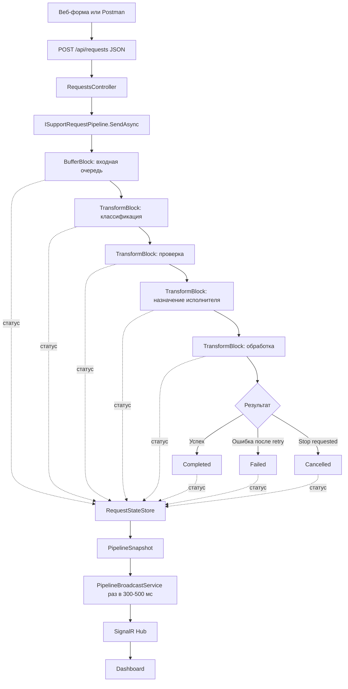

# Responsive Processing Studio

## Веб-приложение службы поддержки банка с конвейером обработки заявок

## 0. Что нового в этой версии

Это итоговая версия ТЗ после уточнений с сеньором и правок из финального файла v3.

В этой версии исправлено и добавлено:

1. Исправлена модель отмены: вместо одного `CancellationToken` используются два разных токена, чтобы не ломать graceful stop.
2. Явно прописано, что изменение числа обработчиков выполняется через пересборку графа Dataflow-блоков внутри `SupportRequestPipeline`.
3. Добавлен обязательный JSON REST API для проверки через Postman.
4. Уточнено, что веб-интерфейс тоже отправляет заявку JSON-ом через `fetch` в тот же API, что и Postman.
5. Добавлена валидация входных данных и поведение при переполненной очереди.
6. Уточнено, что `BoundedCapacity` ставится на каждый Dataflow-блок, а не только на входную очередь.
7. Уточнено, что `PropagateCompletion = true` обязателен при связывании блоков.
8. Уточнено, что исключения не должны покидать Dataflow-блоки, иначе блок перейдёт в `Faulted`.
9. Уточнено, что SignalR отправляет snapshot раз в 300–500 мс, а не событие на каждое изменение статуса.
10. Классификация усилена: тип от клиента плюс fallback по ключевым словам, если тип `Unknown`.
11. Назначение исполнителя оставлено декоративным, без сложной модели занятости сотрудников.
12. `RequestGenerator` перенесён в зону Web/интеграции, чтобы не перегружать Стажёра 4.

---

# 1. Суть проекта простыми словами

Мы делаем веб-приложение для службы поддержки банка.

Клиент создаёт заявку, например:

* вопрос по кредиту;
* проблема с банковской картой;
* вопрос по вкладу;
* проблема с переводом;
* обращение по ипотеке.

Заявка может попасть в систему двумя способами:

1. Через веб-интерфейс.
2. Через JSON-запрос, например из Postman.

После создания заявка не обрабатывается сразу вручную. Она попадает в **конвейер обработки**.

Конвейер работает так:

```text
Поступила заявка
→ Классификация
→ Проверка
→ Назначение исполнителя
→ Обработка
→ Завершение / Ошибка / Отмена
```

На экране пользователь или администратор видит состояние системы в реальном времени:

* сколько заявок ожидает обработки;
* сколько заявок сейчас классифицируется;
* сколько заявок сейчас проверяется;
* сколько заявок сейчас проходит назначение исполнителя;
* сколько заявок сейчас обрабатывается;
* сколько успешно завершено;
* сколько завершилось ошибкой;
* сколько отменено;
* сколько было retry-попыток;
* сколько обработчиков сейчас настроено;
* можно ли остановить обработку;
* не перегружена ли система.

Главная техническая цель проекта — показать не просто CRUD-приложение, а именно **потоковую обработку заявок через TPL Dataflow**.

---

# 2. Почему идея подходит под требования

Идея подходит под все требования. Ниже — короткий чеклист.

| Требование | Как закрыто в проекте |
|---|---|
| Конвейер обработки заявок службы поддержки | Есть явная цепочка из 5 этапов: классификация, проверка, назначение, обработка, завершение |
| Предметная область: служба поддержки | Используется служба поддержки банка |
| TPL Dataflow | `BufferBlock` + несколько `TransformBlock`, это сердце системы |
| Thread-safe структуры | `ConcurrentDictionary`, потокобезопасное состояние заявок, безопасные счётчики метрик |
| Async/Await | API, Dataflow-этапы, retry, имитация внешних сервисов, SignalR — асинхронные |
| Настройка числа обработчиков | Через `MaxDegreeOfParallelism`, применяется пересборкой pipeline |
| Ограничение потока | Через `BoundedCapacity` на каждом Dataflow-блоке |
| Симуляция ошибок и retry | `ErrorSimulator` + `RetryPolicy` на этапах проверки и обработки |
| Отмена обработки | Graceful stop + hard-cancel для retry-задержек |
| Визуальный конвейер | Дашборд с этапами, счётчиками, прогресс-индикацией и SignalR-обновлением |
| Заявка через JSON и Postman | Есть отдельный JSON REST API, который можно вызвать без браузера |

## Требование 1: “Конвейер обработки заявок службы поддержки”

Подходит.

У нас есть явный конвейер:

1. Клиент создаёт заявку.
2. Заявка попадает в очередь.
3. Система классифицирует заявку.
4. Система проверяет заявку.
5. Система назначает исполнителя.
6. Исполнитель обрабатывает заявку.
7. Заявка становится завершённой, ошибочной или отменённой.

Это полностью соответствует предметной области службы поддержки.

## Требование 2: “TPL Dataflow”

Подходит.

Основная обработка строится на блоках TPL Dataflow:

* `BufferBlock<SupportRequest>` — входная очередь заявок;
* `TransformBlock<SupportRequest, SupportRequest>` — классификация;
* `TransformBlock<SupportRequest, SupportRequest>` — проверка;
* `TransformBlock<SupportRequest, SupportRequest>` — назначение исполнителя;
* `TransformBlock<SupportRequest, SupportRequest>` — финальная обработка.

Используются:

* `BoundedCapacity` — ограничение потока;
* `MaxDegreeOfParallelism` — количество параллельных обработчиков;
* `EnsureOrdered = false` — заявки не обязаны завершаться в том же порядке, в котором пришли;
* `PropagateCompletion = true` — корректное завершение цепочки.

## Требование 3: “Thread-safe структуры”

Подходит.

Так как заявки обрабатываются параллельно, обычные `List`, `Dictionary` и простые счётчики использовать нельзя.

Используем:

* `ConcurrentDictionary<Guid, SupportRequest>` — хранение состояния заявок;
* атомарные операции или безопасный пересчёт snapshot;
* отдельный `RequestStateStore` для состояния заявок;
* отдельный `PipelineMetrics` для метрик.

## Требование 4: “Async/Await”

Подходит.

Асинхронными должны быть:

* создание заявки через API;
* отправка заявки в pipeline через `SendAsync`;
* имитация долгой проверки через `await Task.Delay(..., ct)`;
* retry;
* обработка остановки;
* SignalR-обновления;
* получение snapshot через API.

## Требование 5: “Настройка числа обработчиков”

Подходит.

Количество обработчиков задаётся через `MaxDegreeOfParallelism`.

Важное ограничение TPL Dataflow: `MaxDegreeOfParallelism` нельзя изменить у уже созданного блока. Поэтому кнопка “Применить настройки” не просто меняет число в объекте, а вызывает повторный `StartAsync`, который:

1. Корректно останавливает текущий граф блоков.
2. Создаёт новый граф блоков с новыми настройками.
3. Запускает pipeline заново.

Эта логика находится внутри `SupportRequestPipeline`, а не в контроллере.

## Требование 6: “Симуляция ошибок и retry”

Подходит.

Ошибки специально симулируются на этапах:

* проверки заявки;
* финальной обработки.

После ошибки система делает retry:

1. Первая попытка.
2. Если ошибка — задержка.
3. Повторная попытка.
4. Если retry исчерпаны — заявка получает статус `Failed`.

Важно: симулированные ошибки не должны вылетать наружу Dataflow-блока. Иначе блок перейдёт в состояние `Faulted` и перестанет обрабатывать заявки.

## Требование 7: “Отмена обработки”

Подходит.

По умолчанию используется graceful stop:

1. Новые заявки больше не принимаются.
2. Входной блок получает `Complete()`.
3. Уже начатые заявки дорабатываются.
4. Retry-задержки быстро прерываются через отдельный токен остановки.
5. Pipeline ждёт завершения цепочки через `await _lastBlock.Completion`.
6. UI показывает статус `Stopped`.

---

# 3. Главная идея продукта

**Responsive Processing Studio** — это панель управления службой поддержки банка, где видно, как заявки проходят по этапам обработки.

Приложение показывает не только сами заявки, но и работу всей системы:

* очередь;
* этап классификации;
* этап проверки;
* этап назначения исполнителя;
* этап обработки;
* нагрузку;
* ошибки;
* retry;
* отмену;
* ограничение потока;
* текущие настройки pipeline.

То есть это не просто “создать заявку и посмотреть список”. Это именно **визуальная студия обработки заявок**.

---

# 4. Предметная область

## Основная сущность

Основная сущность — банковская заявка клиента.

```csharp
public class SupportRequest
{
    public Guid Id { get; set; } = Guid.NewGuid();

    public string ClientName { get; set; } = string.Empty;

    public string Message { get; set; } = string.Empty;

    public ServiceType ServiceType { get; set; } = ServiceType.Unknown;

    public RequestStatus Status { get; set; } = RequestStatus.Created;

    public int RetryCount { get; set; }

    public string? AssignedDepartment { get; set; }

    public string? AssignedHandler { get; set; }

    public string? LastError { get; set; }

    public DateTime CreatedAt { get; set; } = DateTime.UtcNow;

    public DateTime? UpdatedAt { get; set; }
}
```

## Типы услуг

```csharp
public enum ServiceType
{
    Unknown = 0,
    Credit = 1,
    DebitCard = 2,
    Deposit = 3,
    Mortgage = 4,
    MoneyTransfer = 5
}
```

`Unknown` нужен для сценария, когда клиент не выбрал тип услуги. Тогда классификатор должен определить тип по ключевым словам в тексте.

## Статусы заявки

```csharp
public enum RequestStatus
{
    Created = 0,
    Waiting = 1,
    Classifying = 2,
    Validating = 3,
    Assigning = 4,
    Processing = 5,
    Completed = 6,
    Failed = 7,
    Cancelled = 8
}
```

---

# 5. Как использовать идею сеньора про “услугу как основную сущность”

Сеньор предложил использовать услугу как основную сущность, а вариации сделать через наследование.

Это можно реализовать без лишнего оверинжиниринга.

```csharp
public abstract class BankService
{
    public abstract ServiceType Type { get; }
    public abstract string DisplayName { get; }
    public abstract string RequiredDepartment { get; }
}
```

Конкретные услуги:

```csharp
public class CreditService : BankService
{
    public override ServiceType Type => ServiceType.Credit;
    public override string DisplayName => "Кредит";
    public override string RequiredDepartment => "Кредитный отдел";
}

public class DebitCardService : BankService
{
    public override ServiceType Type => ServiceType.DebitCard;
    public override string DisplayName => "Банковская карта";
    public override string RequiredDepartment => "Карточный отдел";
}

public class DepositService : BankService
{
    public override ServiceType Type => ServiceType.Deposit;
    public override string DisplayName => "Вклад";
    public override string RequiredDepartment => "Отдел вкладов";
}

public class MortgageService : BankService
{
    public override ServiceType Type => ServiceType.Mortgage;
    public override string DisplayName => "Ипотека";
    public override string RequiredDepartment => "Ипотечный отдел";
}

public class MoneyTransferService : BankService
{
    public override ServiceType Type => ServiceType.MoneyTransfer;
    public override string DisplayName => "Денежный перевод";
    public override string RequiredDepartment => "Отдел переводов";
}
```

## Зачем нужна фабрика

Фабрика нужна, чтобы по `ServiceType` получить нужную услугу.

```csharp
public class BankServiceFactory
{
    public BankService Create(ServiceType type) => type switch
    {
        ServiceType.Credit => new CreditService(),
        ServiceType.DebitCard => new DebitCardService(),
        ServiceType.Deposit => new DepositService(),
        ServiceType.Mortgage => new MortgageService(),
        ServiceType.MoneyTransfer => new MoneyTransferService(),
        _ => throw new ArgumentOutOfRangeException(nameof(type))
    };
}
```

Важное уточнение: классификация не должна быть только `switch` по enum. Поэтому делаем два режима:

1. Если клиент выбрал тип услуги — используем его.
2. Если тип `Unknown` — классификатор ищет ключевые слова в тексте.

Пример:

```text
"Хочу узнать ставку по кредиту" → Credit
"Не проходит оплата картой" → DebitCard
"Не дошёл перевод" → MoneyTransfer
"Хочу открыть вклад" → Deposit
"Вопрос по ипотеке" → Mortgage
```

Так этап классификации реально что-то делает, но без ML и лишней сложности.

---

# 6. Общая архитектура проекта

Проект делится на две основные части:

1. `ResponsiveProcessingStudio.Web` — ASP.NET Core, API, Dashboard, SignalR, Postman endpoints, генерация тестовых заявок.
2. `ResponsiveProcessingStudio.Core` — domain, TPL Dataflow pipeline, обработчики этапов, retry, ошибки, состояние, метрики.

## Рекомендуемая структура решения

```text
ResponsiveProcessingStudio.sln
│
├── ResponsiveProcessingStudio.Web
│   ├── Controllers
│   │   ├── RequestsController.cs        // POST /api/requests, GET /api/requests/recent
│   │   └── PipelineController.cs        // start/stop/snapshot/generate
│   │
│   ├── Contracts                        // DTO для JSON API
│   │   ├── CreateRequestDto.cs
│   │   ├── SupportRequestResponseDto.cs
│   │   ├── PipelineOptionsDto.cs
│   │   └── PipelineSnapshotDto.cs
│   │
│   ├── Hubs
│   │   └── PipelineHub.cs
│   │
│   ├── Services
│   │   ├── PipelineBroadcastService.cs  // snapshot раз в 300-500 мс
│   │   └── TestDataGeneratorService.cs  // генерация тестовых заявок
│   │
│   ├── Views / Pages
│   │   ├── Dashboard
│   │   └── CreateRequest
│   │
│   ├── wwwroot
│   │   ├── js/dashboard.js
│   │   └── css/site.css
│   │
│   └── Program.cs
│
├── ResponsiveProcessingStudio.Core
│   ├── Abstractions
│   │   ├── IRequestClassifier.cs
│   │   ├── IRequestValidator.cs
│   │   ├── IRequestAssigner.cs
│   │   ├── IRequestProcessor.cs
│   │   ├── IRetryPolicy.cs
│   │   ├── IErrorSimulator.cs
│   │   ├── IRequestStateStore.cs
│   │   ├── IPipelineMetrics.cs
│   │   └── ISupportRequestPipeline.cs
│   │
│   ├── Domain
│   │   ├── SupportRequest.cs
│   │   ├── BankService.cs
│   │   ├── CreditService.cs
│   │   ├── DebitCardService.cs
│   │   ├── DepositService.cs
│   │   ├── MortgageService.cs
│   │   ├── MoneyTransferService.cs
│   │   ├── ServiceType.cs
│   │   └── RequestStatus.cs
│   │
│   ├── Factories
│   │   └── BankServiceFactory.cs
│   │
│   ├── Processing
│   │   ├── RequestClassifier.cs
│   │   ├── RequestValidator.cs
│   │   ├── RequestAssigner.cs
│   │   └── RequestProcessor.cs
│   │
│   ├── Pipeline
│   │   ├── SupportRequestPipeline.cs
│   │   ├── PipelineOptions.cs
│   │   └── PipelineSnapshot.cs
│   │
│   ├── Retry
│   │   └── RetryPolicy.cs
│   │
│   ├── Simulation
│   │   └── ErrorSimulator.cs
│   │
│   └── State
│       ├── RequestStateStore.cs
│       └── PipelineMetrics.cs
│
└── ResponsiveProcessingStudio.Tests
    ├── RequestClassifierTests.cs
    ├── RequestValidatorTests.cs
    ├── RequestAssignerTests.cs
    ├── RequestProcessorTests.cs
    ├── RetryPolicyTests.cs
    ├── PipelineTests.cs
    └── MetricsTests.cs
```

## Общие интерфейсы

Интерфейсы фиксируются в первый день, до параллельной разработки.

```csharp
public interface IRequestClassifier
{
    Task<SupportRequest> ClassifyAsync(SupportRequest request, CancellationToken ct);
}

public interface IRequestValidator
{
    Task<SupportRequest> ValidateAsync(SupportRequest request, CancellationToken ct);
}

public interface IRequestAssigner
{
    Task<SupportRequest> AssignAsync(SupportRequest request, CancellationToken ct);
}

public interface IRequestProcessor
{
    Task<SupportRequest> ProcessAsync(SupportRequest request, CancellationToken ct);
}

public interface IRetryPolicy
{
    Task<SupportRequest> ExecuteAsync(
        Func<CancellationToken, Task<SupportRequest>> action,
        SupportRequest request,
        int maxRetries,
        TimeSpan delay,
        CancellationToken ct);
}

public interface IErrorSimulator
{
    bool ShouldFail(int errorPercent);
}

public interface IRequestStateStore
{
    void Add(SupportRequest request);
    void Update(SupportRequest request);
    void UpdateStatus(Guid requestId, RequestStatus status);
    IReadOnlyCollection<SupportRequest> GetAll();
    IReadOnlyCollection<SupportRequest> GetRecent(int count);
}

public interface IPipelineMetrics
{
    PipelineSnapshot GetSnapshot();
    void OnStatusChanged(RequestStatus oldStatus, RequestStatus newStatus);
    void IncrementRetry();
}

public interface ISupportRequestPipeline
{
    Task StartAsync(PipelineOptions options, CancellationToken appLifetimeCt);
    Task<bool> SendAsync(SupportRequest request, CancellationToken ct);
    Task StopAsync();
    PipelineSnapshot GetSnapshot();
}
```

---

# 7. Почему такая архитектура не является оверинжинирингом

Мы не делаем:

* микросервисы;
* базу данных;
* Entity Framework;
* CQRS;
* Event Sourcing;
* RabbitMQ;
* Kafka;
* Redis;
* Docker;
* Kubernetes;
* ML-классификацию текста;
* реальную интеграцию с банковскими API;
* настоящую модель занятости сотрудников.

Проект делится всего на две основные части:

1. **Web** — ASP.NET Core, API, Dashboard, SignalR.
2. **Core** — логика обработки заявок.

Это не оверинжиниринг, потому что:

* стажёры могут работать над Core без глубокого знания ASP.NET Core;
* web-разработка остаётся на тебе;
* pipeline можно тестировать отдельно;
* бизнес-логика не размазывается по контроллерам;
* на защите проще показать, где TPL Dataflow, где thread-safe, где async/await.

---

# 8. Главные компоненты системы

## 8.1. Web-приложение

Web-приложение отвечает за:

* создание заявки через форму;
* отправку заявки JSON-ом через `fetch`;
* REST API для Postman;
* отображение дашборда;
* запуск pipeline;
* остановку pipeline;
* применение настроек;
* генерацию тестовых заявок;
* обновление UI через SignalR.

Технологически:

* ASP.NET Core;
* MVC или Razor Pages для страниц;
* API Controllers для JSON REST API;
* SignalR для real-time dashboard;
* обычный JavaScript для фронта.

## 8.2. Core-логика

Core-логика отвечает за:

* сущности заявок;
* типы банковских услуг;
* фабрику услуг;
* классификацию;
* проверку;
* назначение исполнителя;
* обработку;
* retry;
* симуляцию ошибок;
* состояние заявок;
* метрики;
* TPL Dataflow pipeline.

## 8.3. JSON REST API и Postman

Это отдельное требование преподавателя. Оно закрывается не тем, что фронт отправляет JSON, а тем, что у проекта есть самостоятельный JSON endpoint, который можно вызвать без браузера.

Один и тот же контроллер обслуживает оба сценария:

```text
Postman ──POST /api/requests (JSON)────────┐
                                            ├──> RequestsController ──> pipeline.SendAsync(...)
Dashboard JS ──fetch POST /api/requests────┘
```

Контроллер должен быть настоящим API-контроллером:

```csharp
[ApiController]
[Route("api/requests")]
public class RequestsController : ControllerBase
{
}
```

Приём JSON должен идти через `[FromBody]`, а не через обычную HTML-форму.

### Endpoint'ы

| Метод | Маршрут | Назначение |
|---|---|---|
| POST | `/api/requests` | Создать заявку |
| GET | `/api/requests/recent?count=20` | Получить последние N заявок |
| GET | `/api/pipeline/snapshot` | Получить текущие метрики |
| POST | `/api/pipeline/start` | Запустить или перезапустить pipeline с настройками |
| POST | `/api/pipeline/stop` | Остановить pipeline |
| POST | `/api/pipeline/generate?count=100` | Сгенерировать N тестовых заявок |

### DTO для JSON API

```csharp
public record CreateRequestDto(
    [property: Required, MaxLength(100)] string ClientName,
    [property: Required, MaxLength(1000)] string Message,
    ServiceType? ServiceType); // null -> Unknown

public record SupportRequestResponseDto(
    Guid Id,
    string ClientName,
    string Message,
    string ServiceType,
    string Status,
    int RetryCount,
    string? AssignedDepartment,
    string? AssignedHandler,
    string? LastError,
    DateTime CreatedAt,
    DateTime? UpdatedAt);

public record PipelineOptionsDto(
    int WorkersCount,
    int QueueSize,
    int RetryCount,
    int RetryDelayMs,
    int ErrorPercent);

public record PipelineSnapshotDto(
    int WaitingCount,
    int ClassifyingCount,
    int ValidatingCount,
    int AssigningCount,
    int ProcessingCount,
    int CompletedCount,
    int FailedCount,
    int CancelledCount,
    int RetryCount,
    int WorkersCount,
    string PipelineStatus,
    IReadOnlyCollection<SupportRequestResponseDto> RecentRequests);
```

### Пример запроса для Postman

```http
POST http://localhost:5000/api/requests
Content-Type: application/json
```

```json
{
  "clientName": "Иван Петров",
  "message": "Хочу узнать ставку по кредиту",
  "serviceType": null
}
```

Ответ:

```json
{
  "id": "3fa85f64-5717-4562-b3fc-2c963f66afa6",
  "clientName": "Иван Петров",
  "message": "Хочу узнать ставку по кредиту",
  "serviceType": "Unknown",
  "status": "Waiting",
  "retryCount": 0,
  "assignedDepartment": null,
  "assignedHandler": null,
  "lastError": null,
  "createdAt": "2026-07-02T10:15:00Z",
  "updatedAt": null
}
```

Заявка ещё может быть не классифицирована в момент ответа. Это нормально, потому что pipeline работает асинхронно. После этого через `GET /api/requests/recent` или `GET /api/pipeline/snapshot` можно увидеть, что заявка продвинулась по этапам.

### Валидация входных данных

Если имя клиента или сообщение пустые, API возвращает `400 BadRequest`.

Это полезно показать в Postman как отдельный сценарий.

### Поведение при переполненной очереди

Если очередь переполнена, `SendAsync` может ждать освобождения места. Чтобы Postman не висел бесконечно, нужно сделать разумный таймаут, например 5–10 секунд.

Если за это время место не освободилось, endpoint возвращает:

```http
503 Service Unavailable
```

Пример ответа:

```json
{
  "message": "Очередь заявок переполнена, попробуйте позже"
}
```

### Swagger

Swagger необязателен, но его можно добавить. Это не оверинжиниринг: он помогает быстро увидеть все endpoint'ы и тестировать API из браузера.

---

# 9. Конвейер TPL Dataflow

## Общая логика

Заявка проходит этапы:

```text
Входная очередь
    ↓
Классификация
    ↓
Проверка
    ↓
Назначение исполнителя
    ↓
Обработка
    ↓
Завершение / Ошибка / Отмена
```

## Подробная схема



## Главное правило

Исключения не должны покидать Dataflow-блок.

```csharp
var validateBlock = new TransformBlock<SupportRequest, SupportRequest>(
    async request =>
    {
        try
        {
            return await validator.ValidateAsync(request, stopToken);
        }
        catch (OperationCanceledException)
        {
            request.Status = RequestStatus.Cancelled;
            return request;
        }
        catch (Exception ex)
        {
            request.Status = RequestStatus.Failed;
            request.LastError = ex.Message;
            return request;
        }
    }, blockOptions);
```

`OperationCanceledException` ловится отдельно от общего `Exception`. Это важно для корректной остановки.

---

# 10. Какие Dataflow-блоки использовать

## 10.1. Очередь

```csharp
BufferBlock<SupportRequest> inputQueue;
```

Назначение:

* принимает заявки;
* хранит их до обработки;
* показывает, сколько заявок ждёт;
* поддерживает `BoundedCapacity`.

## 10.2. Классификация

```csharp
TransformBlock<SupportRequest, SupportRequest> classifyBlock;
```

Назначение:

* если `ServiceType` указан — использовать его;
* если `ServiceType.Unknown` — определить тип по ключевым словам;
* через `BankServiceFactory` получить нужную услугу;
* обновить статус заявки;
* передать заявку дальше.

Пример классификатора:

```csharp
public class RequestClassifier : IRequestClassifier
{
    private static readonly Dictionary<ServiceType, string[]> Keywords = new()
    {
        [ServiceType.Credit]        = new[] { "кредит", "займ", "ставк" },
        [ServiceType.DebitCard]     = new[] { "карт", "оплатить картой" },
        [ServiceType.Deposit]       = new[] { "вклад", "депозит" },
        [ServiceType.Mortgage]      = new[] { "ипотек" },
        [ServiceType.MoneyTransfer] = new[] { "перевод", "не дошёл", "перевести" }
    };

    public Task<SupportRequest> ClassifyAsync(SupportRequest request, CancellationToken ct)
    {
        if (request.ServiceType == ServiceType.Unknown)
        {
            var text = request.Message.ToLowerInvariant();
            var match = Keywords.FirstOrDefault(kv => kv.Value.Any(text.Contains));
            request.ServiceType = match.Key == default && match.Value == null
                ? ServiceType.Unknown
                : match.Key;
        }

        request.Status = RequestStatus.Classifying;
        request.UpdatedAt = DateTime.UtcNow;
        return Task.FromResult(request);
    }
}
```

## 10.3. Проверка

```csharp
TransformBlock<SupportRequest, SupportRequest> validateBlock;
```

Назначение:

* проверить имя клиента;
* проверить текст обращения;
* проверить тип услуги;
* имитировать обращение к внешнему сервису;
* иногда симулировать ошибку;
* использовать retry;
* уважать `CancellationToken`.

## 10.4. Назначение исполнителя

```csharp
TransformBlock<SupportRequest, SupportRequest> assignBlock;
```

Назначение:

* по типу услуги определить отдел;
* выбрать случайного сотрудника из отдела;
* записать `AssignedDepartment` и `AssignedHandler`;
* обновить статус заявки.

Назначение исполнителя декоративное. Не делаем модель “свободен/занят”, потому что это отдельная concurrency-задача и она не нужна для демонстрации TPL Dataflow.

## 10.5. Финальная обработка

```csharp
TransformBlock<SupportRequest, SupportRequest> processingBlock;
```

Назначение:

* имитировать работу исполнителя;
* делать `await Task.Delay(delay, ct)`;
* иногда симулировать ошибку;
* использовать retry;
* при успехе ставить `Completed`;
* при исчерпанных retry ставить `Failed`;
* при остановке ставить `Cancelled`.

---

# 11. Ограничение потока

Ограничение потока показывается двумя механизмами.

## 11.1. BoundedCapacity

`BoundedCapacity` нужно ставить **на каждый блок**, а не только на входной `BufferBlock`.

```csharp
var blockOptions = new ExecutionDataflowBlockOptions
{
    MaxDegreeOfParallelism = options.WorkersCount,
    BoundedCapacity = options.QueueSize,
    EnsureOrdered = false
};
```

Если поставить `BoundedCapacity` только на входную очередь, заявки могут быстро пройти первый буфер и накопиться дальше, и визуально ограничение потока будет работать плохо.

## 11.2. PropagateCompletion

При связывании блоков обязательно использовать:

```csharp
classifyBlock.LinkTo(validateBlock, new DataflowLinkOptions { PropagateCompletion = true });
validateBlock.LinkTo(assignBlock, new DataflowLinkOptions { PropagateCompletion = true });
assignBlock.LinkTo(processBlock, new DataflowLinkOptions { PropagateCompletion = true });
```

Без `PropagateCompletion = true` вызов `Complete()` на первом блоке не дойдёт до последнего, и graceful stop может зависнуть.

## 11.3. MaxDegreeOfParallelism

```csharp
new ExecutionDataflowBlockOptions
{
    MaxDegreeOfParallelism = 4
}
```

Это значит, что одновременно может обрабатываться максимум 4 заявки.

Если поставить 1 — система работает медленнее.
Если поставить 4 или 8 — видно параллельную обработку.

## 11.4. Изменение числа обработчиков

`MaxDegreeOfParallelism` нельзя изменить у уже созданного блока.

Поэтому повторный вызов `StartAsync` во время работы pipeline должен:

1. вызвать `StopAsync` для текущего графа;
2. дождаться корректного завершения;
3. создать новый граф блоков с новыми настройками.

```csharp
public async Task StartAsync(PipelineOptions options, CancellationToken appLifetimeCt)
{
    if (_lastBlock != null)
        await StopAsync();

    // строим новый граф блоков с options.WorkersCount и options.QueueSize
}
```

---

# 12. Как показывать статусы в реальном времени

На дашборде должны быть карточки:

```text
Ожидает: 12
Классификация: 1
Проверка: 2
Назначение: 1
В обработке: 4
Успешно завершено: 31
Ошибки: 3
Отменено: 1
Retry: 7
Обработчиков: 4
Статус системы: Running
```

Ниже таблица последних заявок:

| ID заявки | Клиент | Тип услуги | Статус | Отдел | Исполнитель | Retry | Ошибка |
|---|---|---|---|---|---|---|---|
| 101 | Иван Петров | Credit | Processing | Кредитный отдел | Мария | 0 | — |
| 102 | Анна Смирнова | DebitCard | Completed | Карточный отдел | Алексей | 1 | — |
| 103 | Олег Иванов | Deposit | Failed | Отдел вкладов | Дмитрий | 3 | Ошибка проверки |

---

# 13. Как сделать обновление UI

Нельзя отправлять SignalR-сообщение на каждое изменение статуса каждой заявки.

При 100 заявках и 5 этапах это даст сотни сообщений и может посадить браузер.

Правильная схема:

```text
Pipeline обновляет thread-safe state
    ↓
Фоновый таймер раз в 300–500 мс берёт snapshot
    ↓
SignalR отправляет один пакет всем клиентам
    ↓
Dashboard обновляет карточки, визуальный pipeline и таблицу
```

Фоновый сервис:

```text
PipelineBroadcastService
    каждые 300–500 мс
    вызывает pipeline.GetSnapshot()
    отправляет snapshot через PipelineHub
```

---

# 14. Потокобезопасное состояние

Состояние заявок хранится отдельно от pipeline.

```csharp
public class RequestStateStore : IRequestStateStore
{
    private readonly ConcurrentDictionary<Guid, SupportRequest> _requests = new();

    public void Add(SupportRequest request)
    {
        _requests[request.Id] = request;
    }

    public void Update(SupportRequest request)
    {
        request.UpdatedAt = DateTime.UtcNow;
        _requests[request.Id] = request;
    }

    public void UpdateStatus(Guid id, RequestStatus status)
    {
        if (_requests.TryGetValue(id, out var request))
        {
            request.Status = status;
            request.UpdatedAt = DateTime.UtcNow;
        }
    }

    public IReadOnlyCollection<SupportRequest> GetAll()
    {
        return _requests.Values.ToList();
    }

    public IReadOnlyCollection<SupportRequest> GetRecent(int count)
    {
        return _requests.Values
            .OrderByDescending(x => x.CreatedAt)
            .Take(count)
            .ToList();
    }
}
```

На защите можно сказать:

> Так как Dataflow обрабатывает заявки параллельно, мы не используем обычный Dictionary. Состояние заявок хранится в ConcurrentDictionary, а UI получает безопасный snapshot.

---

# 15. Retry-механизм

Retry нужен для устойчивости системы.

Если этап проверки или обработки временно падает, заявка не должна сразу становиться `Failed`. Сначала система делает повторные попытки.

Важно: retry не должен выбрасывать обычные симулированные ошибки наружу Dataflow-блока.

Пример интерфейса:

```csharp
public interface IRetryPolicy
{
    Task<SupportRequest> ExecuteAsync(
        Func<CancellationToken, Task<SupportRequest>> action,
        SupportRequest request,
        int maxRetries,
        TimeSpan delay,
        CancellationToken ct);
}
```

Пример логики:

```csharp
public class RetryPolicy : IRetryPolicy
{
    private readonly IPipelineMetrics _metrics;

    public RetryPolicy(IPipelineMetrics metrics)
    {
        _metrics = metrics;
    }

    public async Task<SupportRequest> ExecuteAsync(
        Func<CancellationToken, Task<SupportRequest>> action,
        SupportRequest request,
        int maxRetries,
        TimeSpan delay,
        CancellationToken ct)
    {
        for (int attempt = 1; attempt <= maxRetries + 1; attempt++)
        {
            try
            {
                return await action(ct);
            }
            catch (OperationCanceledException)
            {
                request.Status = RequestStatus.Cancelled;
                request.UpdatedAt = DateTime.UtcNow;
                return request;
            }
            catch (Exception ex)
            {
                request.LastError = ex.Message;

                if (attempt > maxRetries)
                {
                    request.Status = RequestStatus.Failed;
                    request.UpdatedAt = DateTime.UtcNow;
                    return request;
                }

                request.RetryCount++;
                _metrics.IncrementRetry();

                await Task.Delay(delay, ct);
            }
        }

        return request;
    }
}
```

Главное правило:

```csharp
await Task.Delay(delay, ct);
```

Нельзя писать:

```csharp
await Task.Delay(delay);
```

Иначе кнопка “Остановить” не сможет быстро прерывать retry-паузы.

---

# 16. Симуляция ошибок

Для демонстрации ошибок используется `ErrorSimulator`.

```csharp
public class ErrorSimulator : IErrorSimulator
{
    public bool ShouldFail(int errorPercent)
    {
        return Random.Shared.Next(1, 101) <= errorPercent;
    }
}
```

Пример использования:

* ошибка проверки — зависит от `ErrorPercent`;
* ошибка обработки — зависит от `ErrorPercent`.

На защите это удобно показывать так:

1. Ставим `ErrorPercent = 0` — все заявки проходят успешно.
2. Ставим `ErrorPercent = 30` — появляются retry.
3. Ставим `ErrorPercent = 70` — часть заявок после retry падает в `Failed`.

---

# 17. Отмена обработки

Отмена — один из самых важных технических моментов проекта.

В черновой модели нельзя использовать один и тот же `CancellationToken` и для Dataflow-блоков, и для прерывания retry-задержек. Это ломает graceful stop.

## Правильная модель: два разных токена

### Токен 1 — токен жизни приложения

Живёт всё время работы приложения. Отменяется только при полном завершении приложения.

Его можно передавать в `ExecutionDataflowBlockOptions.CancellationToken`, потому что при завершении всего приложения действительно нужно всё оборвать.

### Токен 2 — токен текущего запуска pipeline

Создаётся заново при каждом `StartAsync`.

Он используется для:

* `ClassifyAsync`;
* `ValidateAsync`;
* `AssignAsync`;
* `ProcessAsync`;
* `Task.Delay(delay, ct)` внутри retry и симуляции обработки.

Этот токен **не передаётся** в `ExecutionDataflowBlockOptions`, иначе `StopAsync` отменит блок целиком и не даст заявкам корректно доработать.

Пример:

```csharp
public class SupportRequestPipeline : ISupportRequestPipeline
{
    private CancellationTokenSource? _stopRequestedCts;
    private ITargetBlock<SupportRequest>? _inputBlock;
    private IDataflowBlock? _lastBlock;

    public Task StartAsync(PipelineOptions options, CancellationToken appLifetimeCt)
    {
        _stopRequestedCts = new CancellationTokenSource();
        var stopToken = _stopRequestedCts.Token;

        var blockOptions = new ExecutionDataflowBlockOptions
        {
            MaxDegreeOfParallelism = options.WorkersCount,
            BoundedCapacity = options.QueueSize,
            EnsureOrdered = false
            // stopToken сюда НЕ передаём
        };

        // stopToken передаётся внутрь ClassifyAsync/ValidateAsync/AssignAsync/ProcessAsync

        return Task.CompletedTask;
    }

    public async Task StopAsync()
    {
        _stopRequestedCts?.Cancel();
        _inputBlock?.Complete();

        if (_lastBlock != null)
            await _lastBlock.Completion;
    }
}
```

Итог:

```text
Нажали “Остановить”
→ retry-паузы быстро прерываются
→ новые заявки не принимаются
→ уже начатые заявки доходят до конца или получают Cancelled
→ pipeline завершается корректно
→ блоки не уходят в Faulted
```

---

# 18. Распределение обязанностей

## Ты — ASP.NET Core, Web, API, интеграция, лидерская сборка

Твоя зона ответственности — всё, что связано с ASP.NET Core, API, UI и интеграцией Core-логики.

### Что нужно сделать

1. Создать solution.
2. Создать проекты `Web`, `Core`, `Tests`.
3. Настроить ссылки между проектами.
4. Настроить DI.
5. Зарегистрировать pipeline как Singleton.
6. Сделать `RequestsController`.
7. Сделать `PipelineController`.
8. Сделать DTO-контракты для JSON API.
9. Сделать endpoint `POST /api/requests`.
10. Сделать endpoint `GET /api/requests/recent?count=20`.
11. Сделать endpoint `GET /api/pipeline/snapshot`.
12. Сделать endpoint `POST /api/pipeline/start`.
13. Сделать endpoint `POST /api/pipeline/stop`.
14. Сделать endpoint `POST /api/pipeline/generate?count=100`.
15. Сделать валидацию входных данных.
16. Сделать поведение при переполненной очереди: таймаут и `503`.
17. Сделать `PipelineHub`.
18. Сделать `PipelineBroadcastService`, который раз в 300–500 мс отправляет snapshot.
19. Сделать `TestDataGeneratorService` для генерации тестовых заявок.
20. Сделать dashboard.
21. Сделать форму создания заявки.
22. Сделать так, чтобы форма отправляла JSON через `fetch` в `/api/requests`.
23. Сделать визуальный pipeline на фронте.
24. Интегрировать Core-логику стажёров.
25. Подготовить Postman Collection.
26. Подготовить демонстрационный сценарий защиты.

### Твои основные файлы

```text
ResponsiveProcessingStudio.Web
├── Controllers
│   ├── RequestsController.cs
│   └── PipelineController.cs
├── Contracts
│   ├── CreateRequestDto.cs
│   ├── SupportRequestResponseDto.cs
│   ├── PipelineOptionsDto.cs
│   └── PipelineSnapshotDto.cs
├── Hubs
│   └── PipelineHub.cs
├── Services
│   ├── PipelineBroadcastService.cs
│   └── TestDataGeneratorService.cs
├── Views / Pages
│   ├── Dashboard.cshtml
│   └── CreateRequest.cshtml
├── wwwroot/js
│   └── dashboard.js
└── Program.cs
```

### Что ты должен показать на защите

> Я отвечал за ASP.NET Core часть: Web UI, JSON REST API, SignalR, интеграцию с TPL Dataflow pipeline и демонстрацию через Postman. Веб-интерфейс и Postman используют один и тот же endpoint `/api/requests`, поэтому весь входящий поток заявок проходит через единый backend-путь.

## Стажёр 1 — Domain, услуги, фабрика и классификация

### Что он делает

1. Создаёт `SupportRequest`.
2. Создаёт `ServiceType`.
3. Создаёт `RequestStatus`.
4. Создаёт `BankService`.
5. Создаёт наследников:
   * `CreditService`;
   * `DebitCardService`;
   * `DepositService`;
   * `MortgageService`;
   * `MoneyTransferService`.
6. Создаёт `BankServiceFactory`.
7. Создаёт `RequestClassifier`.
8. Реализует классификацию:
   * если тип услуги указан — использовать его;
   * если тип `Unknown` — определить тип по ключевым словам.
9. Пишет тесты на классификацию и фабрику.

### Его зона

```text
Core/Domain
Core/Factories
Core/Processing/RequestClassifier.cs
Tests/RequestClassifierTests.cs
```

### Что он может сказать на защите

> Классификация работает в двух режимах. Если клиент выбрал тип услуги, мы используем его. Если клиент оставил Unknown, классификатор ищет ключевые слова в тексте заявки. Это не ML, но это настоящий этап классификации, а не просто routing.

## Стажёр 2 — TPL Dataflow pipeline

### Что он делает

1. Создаёт `SupportRequestPipeline`.
2. Создаёт `PipelineOptions`.
3. Создаёт `PipelineSnapshot`.
4. Создаёт Dataflow-блоки:
   * `BufferBlock`;
   * `TransformBlock` для классификации;
   * `TransformBlock` для проверки;
   * `TransformBlock` для назначения;
   * `TransformBlock` для обработки.
5. Ставит `BoundedCapacity` на каждый блок.
6. Настраивает `MaxDegreeOfParallelism`.
7. Ставит `EnsureOrdered = false`.
8. Использует `PropagateCompletion = true`.
9. Делает `StartAsync`, `StopAsync`, `SendAsync`, `GetSnapshot`.
10. Реализует пересборку pipeline при повторном `StartAsync`.
11. Реализует два токена отмены.
12. Следит, чтобы исключения не ломали блоки.
13. Пишет тесты на прохождение заявки через pipeline и graceful stop.

### Его зона

```text
Core/Pipeline/SupportRequestPipeline.cs
Core/Pipeline/PipelineOptions.cs
Core/Pipeline/PipelineSnapshot.cs
Tests/PipelineTests.cs
```

### Что он может сказать на защите

> Конвейер построен на TPL Dataflow. У нас есть входной BufferBlock и несколько TransformBlock. Ограничение потока работает через BoundedCapacity на каждом блоке, параллелизм — через MaxDegreeOfParallelism, а корректная остановка — через Complete и PropagateCompletion.

## Стажёр 3 — Thread-safe состояние, метрики и назначение исполнителей

### Что он делает

1. Создаёт `RequestStateStore`.
2. Использует `ConcurrentDictionary<Guid, SupportRequest>`.
3. Создаёт `PipelineMetrics`.
4. Делает `GetSnapshot`.
5. Добавляет счётчики:
   * Waiting;
   * Classifying;
   * Validating;
   * Assigning;
   * Processing;
   * Completed;
   * Failed;
   * Cancelled;
   * Retry.
6. Создаёт `RequestAssigner`.
7. Делает декоративное назначение исполнителя.
8. Пишет тесты на состояние, метрики и назначение.

### Его зона

```text
Core/State/RequestStateStore.cs
Core/State/PipelineMetrics.cs
Core/Processing/RequestAssigner.cs
Tests/RequestStateStoreTests.cs
Tests/PipelineMetricsTests.cs
Tests/RequestAssignerTests.cs
```

### Что он может сказать на защите

> Так как заявки обрабатываются параллельно, состояние хранится в ConcurrentDictionary. Исполнитель назначается как бизнес-атрибут заявки, а реальное ограничение параллельной обработки выполняется через MaxDegreeOfParallelism.

## Стажёр 4 — Retry, ошибки, async/await, cancellation

### Что он делает

1. Создаёт `RetryPolicy`.
2. Создаёт `ErrorSimulator`.
3. Создаёт `RequestValidator`.
4. Создаёт `RequestProcessor`.
5. Добавляет симуляцию ошибок на этапах проверки и обработки.
6. Реализует retry.
7. Обязательно использует `CancellationToken`.
8. Все задержки пишет только так:

```csharp
await Task.Delay(delay, ct);
```

9. Не пишет так:

```csharp
await Task.Delay(delay);
```

10. Ловит `OperationCanceledException` отдельно.
11. Пишет тесты на retry, ошибки, cancellation, validator и processor.

### Его зона

```text
Core/Retry/RetryPolicy.cs
Core/Simulation/ErrorSimulator.cs
Core/Processing/RequestValidator.cs
Core/Processing/RequestProcessor.cs
Tests/RetryPolicyTests.cs
Tests/ErrorSimulatorTests.cs
Tests/RequestValidatorTests.cs
Tests/RequestProcessorTests.cs
```

### Что он может сказать на защите

> Если этап падает, ошибка одной заявки не ломает весь pipeline. Мы делаем retry, а если попытки закончились — переводим заявку в Failed. При остановке retry-задержки быстро прерываются через CancellationToken.

---

# 19. Что должно быть на экране

## Главный дашборд

```text
Responsive Processing Studio
Служба поддержки банка

[Запустить] [Остановить] [Создать заявку] [Сгенерировать 100]

Настройки:
Количество обработчиков: [ 4 ]
Размер очереди: [ 50 ]
Retry попыток: [ 3 ]
Задержка retry, мс: [ 500 ]
Вероятность ошибки: [ 20% ]

Метрики:
Ожидает: 12
Классификация: 1
Проверка: 2
Назначение: 1
В обработке: 4
Успешно: 31
Ошибки: 3
Отменено: 1
Retry: 7
Статус системы: Running
```

Веб-форма создания заявки должна отправлять JSON через JavaScript:

```javascript
const request = {
    clientName: document.getElementById("clientName").value,
    serviceType: document.getElementById("serviceType").value || null,
    message: document.getElementById("message").value
};

await fetch("/api/requests", {
    method: "POST",
    headers: {
        "Content-Type": "application/json"
    },
    body: JSON.stringify(request)
});
```

---

# 20. Более наглядная схема интерфейса

```text
┌─────────────────────────────────────────────────────────────────────┐
│ Responsive Processing Studio                                        │
│ Служба поддержки банка                                              │
├─────────────────────────────────────────────────────────────────────┤
│ [Запустить] [Остановить] [Создать заявку] [Сгенерировать 100]        │
├─────────────────────────────────────────────────────────────────────┤
│ Настройки                                                           │
│                                                                     │
│ Количество обработчиков: [ 4 ]                                      │
│ Максимальный размер очереди: [ 50 ]                                 │
│ Retry попыток: [ 3 ]                                                │
│ Retry delay, ms: [ 500 ]                                            │
│ Вероятность ошибки: [ 20% ]                                         │
│                                                                     │
│ [Применить настройки]                                               │
├─────────────────────────────────────────────────────────────────────┤
│ Метрики в реальном времени                                          │
│                                                                     │
│ ┌──────────────┐ ┌──────────────┐ ┌──────────────┐ ┌──────────────┐ │
│ │ Ожидает      │ │ Проверка     │ │ Обработка    │ │ Завершено    │ │
│ │ 12           │ │ 2            │ │ 4            │ │ 31           │ │
│ └──────────────┘ └──────────────┘ └──────────────┘ └──────────────┘ │
│                                                                     │
│ ┌──────────────┐ ┌──────────────┐ ┌──────────────┐ ┌──────────────┐ │
│ │ Ошибки       │ │ Отменено     │ │ Retry        │ │ Статус       │ │
│ │ 3            │ │ 1            │ │ 7            │ │ Running      │ │
│ └──────────────┘ └──────────────┘ └──────────────┘ └──────────────┘ │
├─────────────────────────────────────────────────────────────────────┤
│ Визуальный конвейер                                                 │
│                                                                     │
│ Очередь → Классификация → Проверка → Назначение → Обработка          │
│   12          1              2             1             4           │
│                                                                     │
│ [=====-----] [==--------] [====------] [=---------] [=======---]     │
├─────────────────────────────────────────────────────────────────────┤
│ Последние заявки                                                    │
│                                                                     │
│ ID    Клиент       Услуга      Статус       Исполнитель   Retry     │
│ 101   Иван         Credit      Processing   Мария         0         │
│ 102   Анна         DebitCard   Completed    Алексей       1         │
│ 103   Олег         Deposit     Failed       Дмитрий       3         │
└─────────────────────────────────────────────────────────────────────┘
```

---

# 21. Демонстрационный сценарий для защиты

## Сценарий 1: обычная работа через UI

1. Запускаем приложение.
2. Ставим:
   * обработчиков: 4;
   * retry: 3;
   * retry delay: 500 мс;
   * error percent: 10%;
   * queue size: 50.
3. Создаём заявку через форму.
4. Показываем, что форма отправляет JSON в `/api/requests`.
5. Видим, как заявка проходит этапы.
6. Показываем SignalR-обновление дашборда.

## Сценарий 2: демонстрация через Postman

1. Отправляем `POST /api/pipeline/start`.
2. Отправляем `POST /api/requests` с JSON.
3. Отправляем `POST /api/requests` с `serviceType: null`, чтобы показать keyword-классификацию.
4. Отправляем `GET /api/pipeline/snapshot`.
5. Показываем, что заявки попали в pipeline.
6. Отправляем `POST /api/pipeline/generate?count=100`.
7. Снова смотрим snapshot.
8. Показываем очередь, обработку, retry, ошибки.

## Сценарий 3: ограничение потока

1. Ставим маленький размер очереди, например 5.
2. Генерируем 100 заявок.
3. Показываем, что система не берёт всё бесконечно.
4. При переполнении API может вернуть `503` с понятным сообщением.

## Сценарий 4: ошибки и retry

1. Ставим `ErrorPercent = 50`.
2. Генерируем 30 заявок.
3. Показываем, что появляются retry.
4. Часть заявок после retry завершается успешно.
5. Часть заявок уходит в `Failed`.

## Сценарий 5: остановка

1. Генерируем 100 заявок.
2. Нажимаем “Остановить”.
3. Новые заявки больше не принимаются.
4. Retry-паузы прерываются.
5. Уже начатые заявки завершаются или получают `Cancelled`.
6. Pipeline не переходит в `Faulted`.

---

# 22. Сравнение с командой, которая использует Channels

| Критерий | TPL Dataflow | Channels |
|---|---|---|
| Уровень абстракции | Выше | Ниже |
| Очереди | Есть готовые блоки | Нужно вручную писать producer/consumer |
| Конвейер | Удобно строится через блоки и `LinkTo` | Нужно вручную связывать этапы |
| Параллелизм | `MaxDegreeOfParallelism` | Нужно вручную запускать workers |
| Ограничение потока | `BoundedCapacity` | Нужно настраивать bounded channel |
| Completion | `Complete` + `PropagateCompletion` | Нужно вручную закрывать каналы |
| Читаемость pipeline | Хорошая | Зависит от реализации |
| Гибкость | Средняя | Высокая |
| Подходит для визуального pipeline | Очень хорошо | Подходит, но больше ручного кода |

Вывод:

> TPL Dataflow лучше подходит для нашего проекта, потому что задача выглядит как цепочка этапов обработки. Dataflow уже даёт готовую модель блоков, связывание этапов, backpressure и настройки параллелизма. Channels более низкоуровневые и требуют больше ручной реализации.

---

# 23. Минимальный список функций для MVP

MVP считается готовым, если работает следующее:

1. Можно открыть веб-приложение.
2. Можно создать заявку через UI.
3. UI отправляет заявку JSON-ом через `fetch`.
4. Можно создать заявку через Postman.
5. Есть `POST /api/requests`.
6. Есть `GET /api/pipeline/snapshot`.
7. Есть `POST /api/pipeline/start`.
8. Есть `POST /api/pipeline/stop`.
9. Есть `POST /api/pipeline/generate?count=100`.
10. Можно выбрать тип услуги или оставить `Unknown` / `null`.
11. Если тип не указан, классификатор определяет тип по тексту.
12. Заявка попадает в TPL Dataflow pipeline.
13. Заявка проходит этапы: очередь, классификация, проверка, назначение, обработка.
14. На экране видны метрики.
15. Можно настроить число обработчиков.
16. Изменение числа обработчиков пересобирает pipeline.
17. Можно настроить размер очереди.
18. `BoundedCapacity` стоит на каждом блоке.
19. Можно настроить процент ошибок.
20. Можно настроить число retry.
21. Ошибки симулируются.
22. Retry работает.
23. После неудачных retry заявка становится `Failed`.
24. Можно нажать “Остановить”.
25. Остановка работает через два токена.
26. UI обновляется через SignalR snapshot раз в 300–500 мс.
27. Есть визуальная схема pipeline.
28. Есть Postman Collection для демонстрации.

---

# 24. Что лучше не делать, чтобы не уйти в оверинжиниринг

Не делаем:

* настоящую авторизацию банка;
* настоящую базу данных;
* Entity Framework;
* роли пользователей;
* личные кабинеты клиентов;
* микросервисы;
* RabbitMQ;
* Kafka;
* Redis;
* Docker;
* Kubernetes;
* ML-классификацию текста;
* настоящие интеграции с банковскими сервисами;
* настоящую модель “сотрудник свободен/занят”.

Почему:

цель проекта — показать TPL Dataflow, потоковую обработку, thread-safe структуры, async/await, retry, отмену, JSON API и real-time dashboard.

---

# 25. Что можно добавить, если останется время

Если MVP готов, можно добавить:

1. Swagger.
2. Цветные статусы заявок.
3. Фильтр по статусам.
4. Отдельную вкладку “Ошибки”.
5. График скорости обработки.
6. Среднее время обработки заявки.
7. Кнопку “Очистить статистику”.
8. Экспорт ошибок в JSON.
9. Переключатель, где именно симулировать ошибку:
   * проверка;
   * назначение;
   * обработка.
10. Страницу сравнения TPL Dataflow vs Channels.
11. Маленькую CSS-анимацию движения заявки по pipeline.

Важно: всё это только после MVP.

---

# 26. Итоговая формулировка проекта для защиты

Наш проект — это веб-приложение службы поддержки банка, которое демонстрирует потоковую обработку клиентских заявок через TPL Dataflow.

Клиент создаёт заявку через веб-интерфейс или отправляет JSON-запрос через Postman. Веб-интерфейс и Postman используют один и тот же API endpoint `/api/requests`, поэтому весь входящий поток заявок проходит через единый backend-путь.

Заявка попадает в очередь, затем проходит классификацию, проверку, назначение исполнителя и финальную обработку. Если клиент указал тип услуги, система использует его. Если тип не указан, классификатор определяет тип по ключевым словам в тексте заявки.

Система показывает состояние обработки в реальном времени: сколько заявок ожидает, сколько находится на каждом этапе, сколько завершено успешно, сколько завершилось ошибкой, сколько отменено и сколько retry-попыток было выполнено.

Количество обработчиков настраивается через `MaxDegreeOfParallelism`. Так как этот параметр нельзя изменить у уже созданного Dataflow-блока, повторный запуск pipeline пересобирает граф блоков с новыми настройками. Поток заявок ограничивается через `BoundedCapacity` на каждом блоке.

Ошибки симулируются искусственно. Если этап падает, заявка проходит retry. Если retry не помог, заявка получает статус `Failed`. Исключения не покидают Dataflow-блоки, поэтому ошибка одной заявки не ломает весь pipeline.

Остановка реализована через graceful stop и два токена отмены: один токен относится к жизни приложения, второй — к текущему запуску pipeline и используется для быстрого прерывания retry-задержек. Благодаря этому pipeline корректно завершает обработку, не переходя в `Faulted`.

Технически проект показывает применение TPL Dataflow, thread-safe структур, async/await, CancellationToken, retry-механизма, JSON REST API, Postman-тестирования и real-time обновлений через ASP.NET Core SignalR.

---

# 27. План работы по дням

## День 0 / День 1

1. Создать solution.
2. Создать проекты `Web`, `Core`, `Tests`.
3. Создать domain-классы и enum'ы.
4. Создать интерфейсы в `Core/Abstractions`.
5. Зафиксировать сигнатуры методов.
6. Создать заглушки реализаций.
7. Добиться, чтобы проект собирался.
8. Добиться, чтобы pipeline запускался хотя бы на fake-реализациях.

Главная цель:

```text
Проект собирается.
Все интерфейсы есть.
Pipeline можно запустить на заглушках.
Никто из стажёров не блокирует остальных.
```

## День 2

1. Стажёр 1 делает domain, фабрику и классификацию.
2. Стажёр 2 делает Dataflow pipeline.
3. Стажёр 3 делает state store, метрики и назначение.
4. Стажёр 4 делает retry, ошибки, validator и processor.
5. Ты делаешь ASP.NET Core API, DI и базовый UI.

## День 3

1. Интеграция Core и Web.
2. Подключение SignalR.
3. Создание dashboard.
4. Настройка JSON API.
5. Первые проверки через Postman.

## День 4

1. Доработка остановки.
2. Проверка двух токенов отмены.
3. Проверка retry.
4. Проверка BoundedCapacity.
5. Проверка поведения при переполненной очереди.
6. Проверка пересборки pipeline при смене числа обработчиков.

## День 5

1. Полировка UI.
2. Подготовка Postman Collection.
3. Подготовка сценариев защиты.
4. Подготовка сравнения с Channels.
5. Репетиция защиты.

---

# 28. Финальный чеклист перед стартом кодирования

Перед тем как стажёры начнут писать код, нужно проверить:

1. Все согласны с domain-моделью.
2. Все согласны с enum `ServiceType`.
3. Все согласны с enum `RequestStatus`.
4. Все интерфейсы в `Core/Abstractions` созданы.
5. Никто не меняет интерфейсы без согласования.
6. Все знают правило: exception не покидает Dataflow-блок.
7. Все знают, что `OperationCanceledException` ловится отдельно.
8. Все знают, что `BoundedCapacity` ставится на каждый блок.
9. Все знают, что `PropagateCompletion = true` обязателен.
10. Все знают, что pipeline — Singleton в DI.
11. Все знают, что stop-токен не передаётся в `ExecutionDataflowBlockOptions`.
12. Все знают, что смена числа обработчиков — это пересборка pipeline.
13. Все знают, что SignalR работает через snapshot раз в 300–500 мс.
14. Все знают, что JSON REST API обязателен.
15. Все знают, что Postman Collection обязательна для защиты.
16. Все знают, что веб-форма отправляет JSON через `fetch` в тот же endpoint, что и Postman.
17. Все знают, что назначение исполнителя декоративное.
18. Все знают, что `RequestGenerator` находится в Web как `TestDataGeneratorService`.
